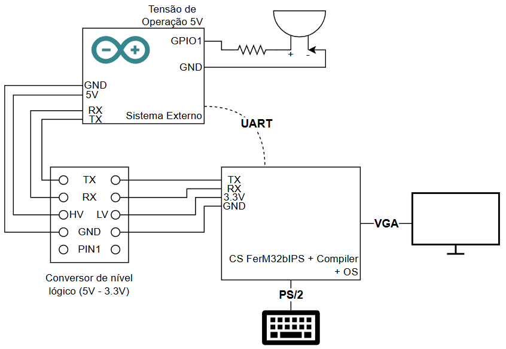
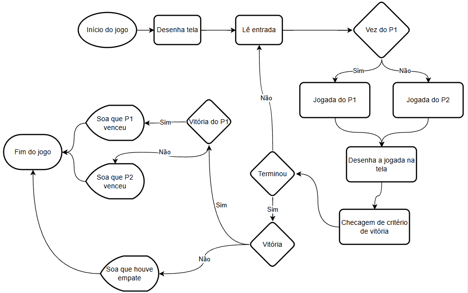

# Jogo da Velha em Sistemas Computacionais Integrados

Este projeto contempla a implementação de um jogo da velha em que dois sistemas interagem entre sí.
O desenvolvimento deste trabalho é parte da pontuação da disciplina Laboratório de Sistemas Computacionais: Comunicação Digital, ministrada na Universidade Federal de São Paulo, no Curso de Engenharia de Computação.

## Desenvolvimento
... TESTEEEEEEEEEEEEEEEEEEEEEEEEEEEEEEEEEEEEEEEEEEEEEEEEEEEE

... TESTEEEEEEEEEEEEEEEEEEEEEEEEEEEEEEEEEEEEEEEEEEEEEEEEEEEE

... TESTEEEEEEEEEEEEEEEEEEEEEEEEEEEEEEEEEEEEEEEEEEEEEEEEEEEE

... TESTEEEEEEEEEEEEEEEEEEEEEEEEEEEEEEEEEEEEEEEEEEEEEEEEEEEE

## Resultados

## Agradecimentos
À todos colegas que dispuseram de conversas sobre suas implementações. À todos colegas que já concluíram o curso e gentilmente disponibilizaram seus trabalhos como referências. Ao docente Prof. Dr. André Marcorin por toda paciência, atenção e dedicação dada à mim e aos colegas de turma.